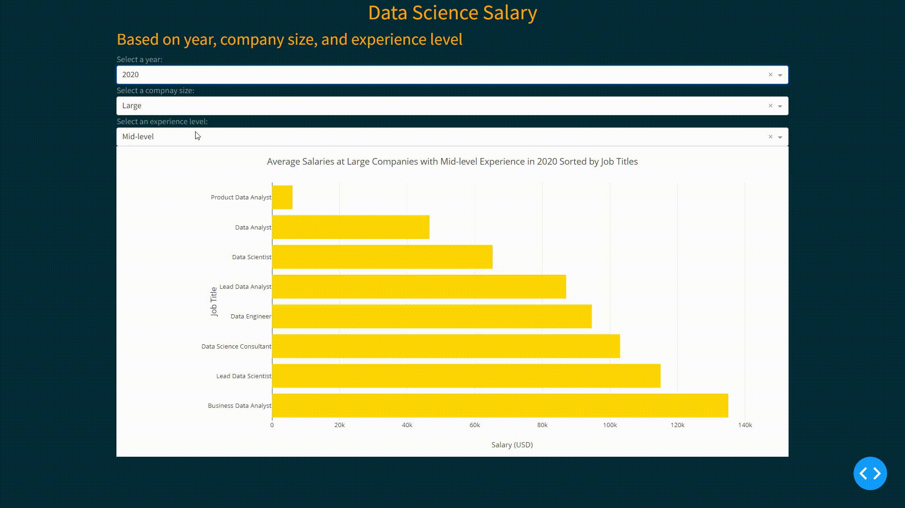

# Data Science Salary

-   Author: Yaou Hu

## Data Science Salary Dash App

The dash app has been deployed on Render.com. It can be accessed [here](https://data-science-salary.onrender.com/).



## Motivation and research questions

The link to my group milestone proposal: https://github.com/UBC-MDS/DS-Salaries/blob/main/reports/proposal.md

Target audience: Our main target audience includes individuals searching for employment in the Data Science space. A secondary audience includes managers, recruiters, and founders looking to build a talented Data Science team.

The main research questions addressed by DS-Salaries is:

-   What are the the average data science salaries of different job titles based on the year, company size, and experience level?

## Description of the app

Based on the motivation and aim of this app, it has a landing page that shows the distribution of data scientist salaries depending on the candidate’s experience level, the year of data collection, job titles, and company size.

Specifically, this app shows the job titles with the average salary in descending order, filtered by the year, company size, and experience level. Users can use the dropdown menus to select the year, company size, and experience level of their interest. If the users put the mouse on top of the bar chart, they can see the values of the average salary of each job title. 

## Installation

To install `data_science_salary` locally, you can:

1. Clone this repository with:

```
git clone https://github.com/YHuUBC/data_science_salary.git
```

2. Install the environment of this project in your terminal at the root directory with the following code:

```
conda env create -f data_science_salary.yaml
```
3. Then, change your environment to this project's environment with the following code:
```
conda activate data_science_salary
```
4. Move to the `root` directory and run the following command to run the app locally:

```{Python}
python app.py
```

## Get Involved

If you are interested in contributing to the app we welcome to share your thoughts. Particularly we would appreciate:

-   Additional data. This app is constantly evolving and being updated with new data. If you posses data related to Data Science salaries that can be applied to this Dashboard we would highly appreciate your contribution.

## Contact us

If you would like to help with the development of this Dashboard. Please feel free to contact me (email: yaouhu@student.ubc.ca) after referring to our [contributor's guidelines](CONTRIBUTING.md)

## License

Licensed under the terms of the [MIT license](LICENSE).
